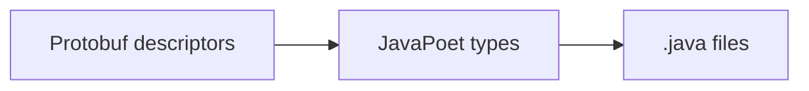
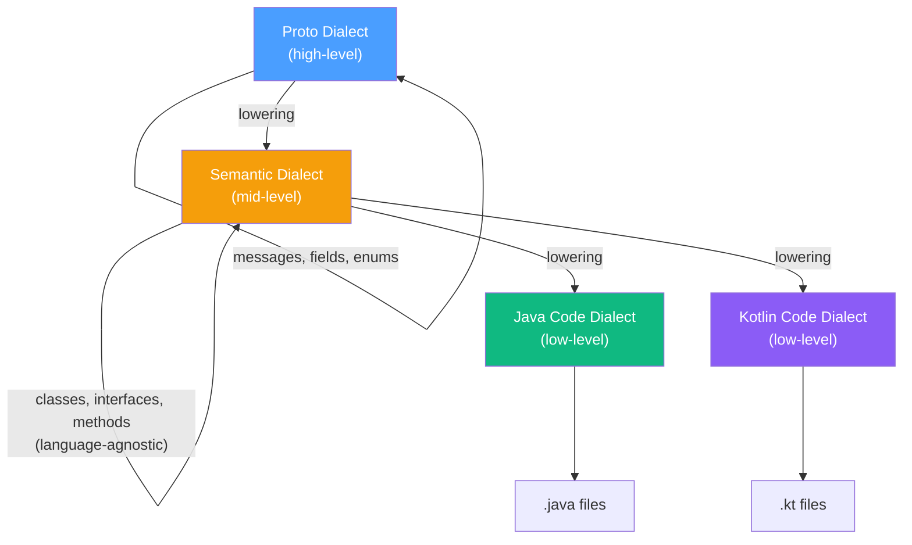
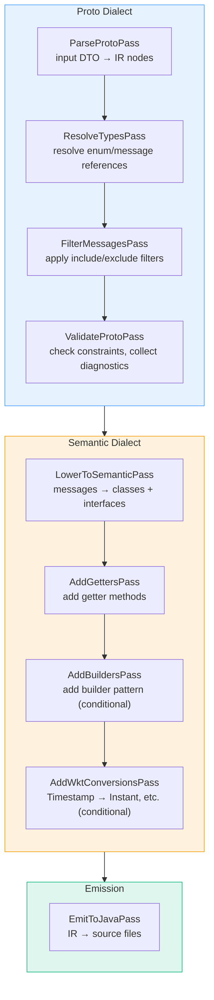
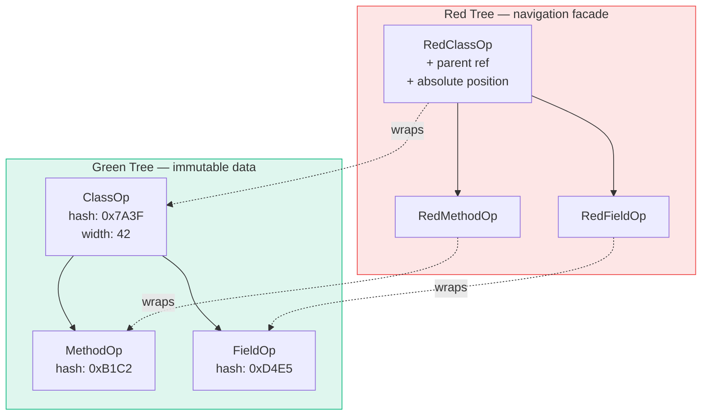
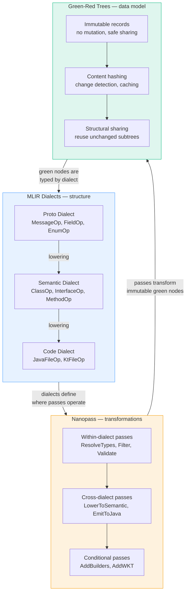

Most code generators are monolithic. A single class reads some input, makes a bunch of decisions, and spits out source files. It works until it doesn't — until you need to support another target language, until you need incremental builds, until a 2000-line generator method becomes everyone's least favorite file to touch.

I hit this wall while building [Proto Wrapper Plugin](https://github.com/alnovis/proto-wrapper-plugin), a tool that generates version-agnostic Java wrappers from multiple protobuf schemas. The generator worked fine, but every new feature meant wrestling with a monolith. Adding Kotlin support would have meant duplicating the entire thing.

So I went looking for better ideas. I found three — from compiler design, of all places — and they changed how I think about code generation entirely.

## The Three Concepts

| Concept | Origin | What it gives you |
|---------|--------|-------------------|
| **MLIR Dialects** | LLVM/MLIR project | Structure — multiple abstraction levels with typed operations |
| **Nanopass** | Academic compiler research | Modularity — many small composable transformations |
| **Green-Red Trees** | Roslyn (C# compiler) | Immutability — safe, cacheable, incrementally updatable AST |

Each one is powerful on its own. Together, they form an architecture that's extensible, testable, and surprisingly elegant.

Let's look at each one.

---

## MLIR: Stop Mixing Abstraction Levels

### The Idea

[MLIR](https://mlir.llvm.org/) (Multi-Level Intermediate Representation) is an LLVM project that structures compiler IR into *dialects* — groups of operations at a specific abstraction level. Instead of one giant IR that represents everything from high-level constructs to machine instructions, MLIR lets you define separate dialects and *lower* between them progressively.

The key insight: **different stages of compilation think in different abstractions.** Forcing everything into one representation creates a mess.

### How This Applies to Code Generation

A typical code generator goes straight from input to output:



Everything happens at once. The code that understands protobuf semantics is tangled with the code that knows Java syntax. Want to add Kotlin output? You'd need to rewrite everything.

With dialects, you get clean separation:



Each dialect defines its own *operations* — typed IR nodes that belong to that abstraction level. A `MessageOp` belongs to the Proto Dialect. A `ClassOp` belongs to the Semantic Dialect. You can't accidentally mix them.

The critical piece is the **Semantic Dialect** — it captures OOP concepts (classes, interfaces, methods, fields) without any language-specific details. This layer is shared. Adding Kotlin support means writing a new Code Dialect and an emission pass. The entire Proto → Semantic pipeline stays untouched.

### Beyond Code Generators

The dialect idea applies anywhere you have multiple abstraction levels:

- **API gateways** — represent requests at the protocol level (HTTP, gRPC), the domain level (business operations), and the backend level (database queries, service calls)
- **Configuration management** — high-level intent ("deploy this service with 3 replicas"), mid-level plan ("create these Kubernetes resources"), low-level actions ("apply these YAML files")
- **Data pipelines** — logical plan (what to compute), physical plan (how to compute it), execution plan (where to run it)

The pattern is always the same: define clean abstraction boundaries, type the operations at each level, and lower progressively.

---

## Nanopass: Small Passes Beat Big Passes

### The Idea

The [Nanopass Framework](https://nanopass.org/) comes from academic compiler research. Its premise is simple: instead of a few large compiler passes that each do many things, write many small passes that each do one thing.

A traditional compiler might have a "type checking" pass that also resolves overloads, infers types, checks visibility, and validates constraints. A nanopass compiler splits that into five separate passes, each focused on a single concern.

### How This Applies to Code Generation

My original generator was one method that:

1. Read protobuf descriptors
2. Decided which messages to include
3. Resolved type references
4. Detected type conflicts between versions
5. Generated interfaces
6. Generated abstract classes
7. Generated implementations
8. Generated builders (conditionally)
9. Generated VersionContext factory
10. Wrote files

That's 10 responsibilities in one place. Testing any of them in isolation was nearly impossible.

With nanopass, each becomes a standalone transformation:



Each pass is a pure function: immutable input → immutable output. Each can be tested with a 10-line unit test. Each can be conditionally enabled:

```java
// AddBuildersPass only runs when the user configured generateBuilders=true
@Override
public boolean isEnabled(PassContext context) {
    return context.getConfig("generateBuilders", false);
}
```

### The Composition Problem

Small passes need a way to compose. In our case, it's a simple pipeline:

```java
Pipeline<ProtoFileInput, List<JavaFile>> pipeline = Pipeline
    .from(ProtoFileInput.class)
    .then(new ParseProtoPass())
    .then(new ResolveTypesPass())
    .then(new FilterMessagesPass())
    .then(new ValidateProtoPass())
    // ... more passes
    .build();

List<JavaFile> output = pipeline.execute(input, context);
```

The pipeline handles execution order, skips disabled passes, and logs timing. Passes communicate through `PassContext` — a typed key-value store for shared data (e.g., a type registry built by one pass and consumed by another).

### Beyond Code Generators

Nanopass is just the [Single Responsibility Principle](https://en.wikipedia.org/wiki/Single-responsibility_principle) applied to data transformations. It works anywhere you have a processing pipeline:

- **Image processing** — resize, crop, watermark, compress, optimize — each as a separate filter
- **Request validation** — authenticate, authorize, validate schema, check rate limits, sanitize input — each as middleware
- **Data migration** — extract, clean, transform, validate, load — each as a named step with independent rollback
- **Document processing** — parse, normalize, enrich, validate, render — each as a pipeline stage

The pattern gives you testability (test each step alone), composability (add/remove/reorder steps), and observability (log/time each step independently).

---

## Green-Red Trees: Immutability That Pays for Itself

### The Idea

[Green-Red Trees](https://ericlippert.com/2012/06/08/red-green-trees/) come from Roslyn, Microsoft's C# and VB.NET compiler. The problem Roslyn solves: an IDE needs to re-parse code on every keystroke, but re-creating the entire syntax tree each time is expensive.

The solution splits the tree into two layers:



**Green tree** (the data):
- Immutable
- Content-addressable (identity based on content, not object reference)
- No parent references
- Relative positions (width), not absolute

**Red tree** (the navigation):
- Lightweight facade over green nodes
- Adds parent references and absolute positions
- Created lazily during traversal
- Thrown away entirely on any change

The insight: **most of the tree doesn't change between edits.** If you insert a character on line 50, every node on lines 1-49 is structurally identical. With content-based identity, you can reuse those green nodes directly — no copying, no diffing.

### How This Applies to Code Generation

All our IR nodes are Java records — immutable by design. Each computes a `contentHash` from its content:

```java
public record MessageOp(
    String name,
    List<FieldOp> fields,
    List<OneofOp> oneofs,
    Map<String, Attribute> attrs,
    int contentHash,
    int width
) implements Operation {

    public MessageOp {
        // Auto-compute hash from content
        if (contentHash == 0) {
            contentHash = computeHash(name, fields, oneofs, attrs);
        }
    }
}
```

Two `MessageOp` nodes with the same content have the same hash. This gives us:

**Change detection.** After running a pass, compare output hash to input hash. Same hash? Nothing changed — skip downstream passes for this node.

**Caching.** Store `contentHash → generated output` mapping. If a proto file hasn't changed, reuse the previous output without running the pipeline.

**Incremental builds.** In a project with 50 proto files, changing one file triggers regeneration for only that file's IR subtree. Everything else is a cache hit.

The "red tree" layer (parent references, absolute positions) is planned for IDE integration — enabling "go to definition" and "find usages" across proto schemas and generated code.

### Why Immutability Matters for Passes

Nanopass transformations are pure functions: `GreenNode(v1) → GreenNode(v2)`. The input is never modified. This means:

- **No defensive copying.** You know the input won't change under you.
- **Safe parallelism.** Multiple passes can read the same input concurrently.
- **Time travel.** Keep the input around for debugging — it's immutable, it won't change.
- **Structural sharing.** If a pass only modifies 2 out of 20 fields in a message, the unmodified field ops are shared between input and output trees.

### Beyond Code Generators

Immutable content-addressed trees appear in many systems:

- **Git** — the entire object model (blobs, trees, commits) is content-addressed and immutable. Every `git commit` creates new tree objects while sharing unchanged blobs.
- **React** — virtual DOM diffing works because components produce immutable trees that can be compared efficiently.
- **Nix** — the package manager uses content-addressed derivations. Same inputs always produce the same output hash.
- **Persistent data structures** — Clojure's vectors, maps, and sets use structural sharing to create "modified" copies in O(log n) time.
- **Event sourcing** — events are immutable facts. State is derived by replaying events, with snapshots as caching.

The principle is the same: make data immutable, identify it by content, share structure where possible.

---

## How They Work Together

The three concepts are complementary:



A concrete example from Proto Wrapper:

```java
// 1. Input arrives as a lightweight DTO
ProtoFileInput input = ProtoFileInput.builder("order.proto", ProtoSyntax.PROTO3)
    .message(MessageInput.builder("Order")
        .field(FieldInput.builder("id", 1).type(STRING).build())
        .field(FieldInput.builder("items", 2).message("Item").repeated().build())
        .build())
    .build();

// 2. ParseProtoPass converts DTO to Proto Dialect operations (green nodes)
ProtoFileOp protoFile = new ParseProtoPass().apply(input, ctx);
// protoFile.contentHash() = 0x7A3F... (computed from content)

// 3. ResolveTypesPass transforms within Proto Dialect
ProtoFileOp resolved = new ResolveTypesPass().apply(protoFile, ctx);
// If nothing changed: resolved.contentHash() == protoFile.contentHash()
// Same object reused — no allocation

// 4. ValidateProtoPass checks constraints
ProtoFileOp validated = new ValidateProtoPass().apply(resolved, ctx);

// 5. LowerToSemanticPass crosses dialect boundary: Proto → Semantic
List<ClassOp> classes = new LowerToSemanticPass().apply(validated, ctx);

// 6. More passes add methods, builders, etc.
// 7. Final pass emits Java source files
```

Each step produces immutable green nodes. Each step can be tested independently. Each step operates at the right abstraction level. And the content hashes enable caching at every stage.

---

## When to Use These Ideas

You don't need all three concepts, and you don't need to build a full compiler framework. Here's when each one pays off:

**MLIR Dialects** — when your system has multiple abstraction levels and you're fighting the urge to put everything in one data model. If you find yourself adding "kind" or "type" fields to distinguish between fundamentally different operations, you probably want dialects.

**Nanopass** — when you have a processing pipeline with more than 3-4 concerns. If your `generate()` or `process()` method is over 200 lines and growing, break it into passes.

**Green-Red Trees** — when you need change detection, caching, or incremental processing. If your data is already immutable (or should be), content hashing is a natural extension.

## Practical Advice

**Start with nanopass.** It's the easiest to adopt and gives the most immediate benefit. Take your monolithic processor, identify the distinct responsibilities, and extract them into passes. You'll immediately gain testability.

**Add content hashing when you need caching.** If your pipeline runs on every build and takes noticeable time, add `contentHash()` to your data types. Use it for short-circuiting ("nothing changed, skip this pass") and caching ("same input, return cached output").

**Introduce dialects when you add a second target.** If you only generate Java, one abstraction level might be fine. The moment you need Kotlin, TypeScript, or any second output format, the dialect split pays for itself instantly.

**Don't over-abstract.** These are tools, not rules. A 50-line code generator doesn't need an IR framework. Use the ideas when the complexity justifies them — and not a moment sooner.

---

## Further Reading

- [MLIR: A Compiler Infrastructure for the End of Moore's Law](https://arxiv.org/abs/2002.11054) — the original MLIR paper
- [MLIR Tutorial](https://mlir.llvm.org/docs/Tutorials/Toy/) — LLVM's hands-on tutorial
- [A Nanopass Framework for Compiler Education](https://legacy.cs.indiana.edu/~dyb/pubs/nano-jfp.pdf) — the foundational nanopass paper
- [Nanopass Framework for Commercial Compiler Development](https://andykeep.com/pubs/np-preprint.pdf) — nanopass in practice
- [Persistence, Facades, and Roslyn's Red-Green Trees](https://ericlippert.com/2012/06/08/red-green-trees/) — Eric Lippert's original blog post
- [Red-Green Syntax Trees: An Overview](https://willspeak.me/2021/11/24/red-green-syntax-trees-an-overview.html) — accessible summary with examples
- [Proto Wrapper Plugin](https://github.com/alnovis/proto-wrapper-plugin) — where we're applying all of this
