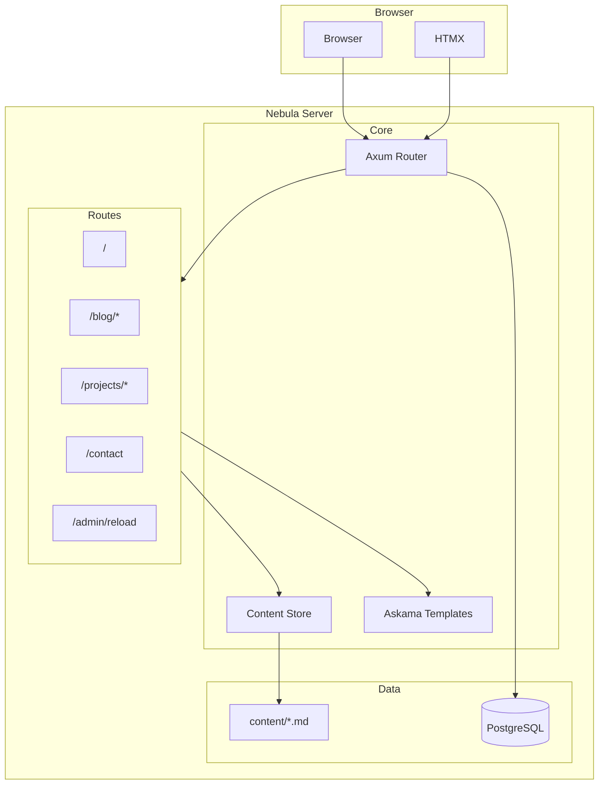
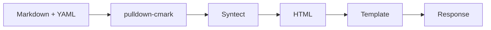
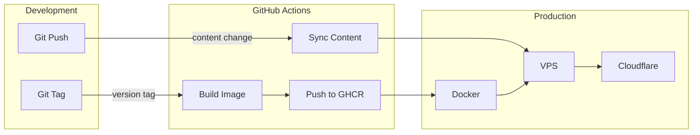

Nebula is the engine powering this website. A lightweight blog platform built with Rust, designed for speed, simplicity, and compile-time safety.

## Why Build a Custom Engine?

Static site generators like Hugo are great. They're fast, well-documented, and have tons of themes. So why build something custom?

**Learning** — I wanted hands-on experience with Rust web development. Not tutorials, not toy projects — something that runs in production.

**Control** — No fighting with theme limitations. Need a feature? Implement it exactly how you want.

**Fun** — Not everything needs to be pragmatic. Sometimes you build things because it's interesting.

## Architecture



**Request Flow:**

1. Browser sends request
2. Axum routes to appropriate handler
3. Handler reads from Content Store (cached in memory)
4. Askama renders template (compile-time checked)
5. Response sent to browser
6. HTMX handles partial updates if needed

## Content Pipeline

Blog posts and projects live as Markdown files with YAML frontmatter:



**pulldown-cmark** parses Markdown with extensions (tables, footnotes, strikethrough, task lists).

**Syntect** provides syntax highlighting for code blocks with the base16-ocean.dark theme.

**Mermaid** diagrams render client-side for architecture visualizations.

Content is loaded at startup and cached in memory. Hot reload is available via admin endpoint — no redeploy needed for content changes.

## The Stack in Detail

### Axum

The web framework. Built on Tokio and Tower, it provides:

- Type-safe request extraction
- Composable middleware (compression, tracing, CORS)
- Async handlers with excellent ergonomics

```rust
pub async fn show(
    State(state): State<AppState>,
    Path(slug): Path<String>,
) -> Result<Html<String>, StatusCode> {
    let content = state.content.read().await;
    let post = content.posts.get(&slug)
        .ok_or(StatusCode::NOT_FOUND)?;
    // ...
}
```

The type signature tells you everything. Compiler enforces it.

### Askama

Templates that compile to Rust code. If it compiles, it works.

```rust
#[derive(Template)]
#[template(path = "blog/post.html")]
struct BlogPostTemplate<'a> {
    title: &'a str,
    content: &'a str,
}
```

Typo in a variable name? Compilation fails. Not deployment. Not runtime.

### HTMX

Interactivity without JavaScript frameworks. The server returns HTML fragments, HTMX swaps them into the page.

The contact form submits via HTMX, shows success/error messages, and that's it. No React. No Vue. No build step.

### SQLx

Compile-time checked SQL queries:

```rust
let messages = sqlx::query_as!(
    ContactMessage,
    "SELECT * FROM contact_messages WHERE created_at > $1",
    cutoff
)
.fetch_all(&pool)
.await?;
```

Misspell a column? Compiler catches it.

## Features

**Hot content reload** — Edit markdown files, call `/admin/reload`, changes are live. No redeploy.

**Cloudflare integration** — CDN, SSL, analytics in one place. Origin certificates, no Let's Encrypt renewal hassle.

**Contact form** — Cloudflare Turnstile for bot protection, Resend for email delivery.

**RSS feed** — Standard RSS 2.0 for blog posts.

**Sitemap** — Auto-generated XML sitemap for search engines.

**Syntax highlighting** — Code blocks with proper highlighting via Syntect.

**Mermaid diagrams** — Architecture diagrams rendered client-side.

## Performance

For a blog, performance metrics are academic. But they're satisfying:

| Metric | Value |
|--------|-------|
| Response time | <10ms |
| Memory usage | ~20MB |
| Binary size | 15MB |
| JavaScript | HTMX (~14KB) + analytics |
| Cold start | Negligible |

The entire site could run on a Raspberry Pi.

## Deployment



**Code changes:** Push a tag, GitHub Actions builds Docker image, pushes to GHCR, deploys to VPS.

**Content changes:** Push to main, GitHub Actions syncs content directory, calls reload endpoint.

The binary runs behind Cloudflare. SSL terminated at the edge, responses cached where appropriate.

## Tech Stack

| Component | Technology |
|-----------|------------|
| Language | Rust |
| Framework | Axum 0.7 |
| Templates | Askama |
| Frontend | HTMX |
| Database | PostgreSQL |
| Markdown | pulldown-cmark |
| Highlighting | Syntect |
| Diagrams | Mermaid |
| Email | Resend API |
| Bot Protection | Cloudflare Turnstile |
| Deployment | Docker + GitHub Actions |
| CDN/SSL | Cloudflare |

## Links

- [GitHub Repository](https://github.com/alnovis/nebula)
- [Blog Post](/blog/hello-world) — Why I built it
