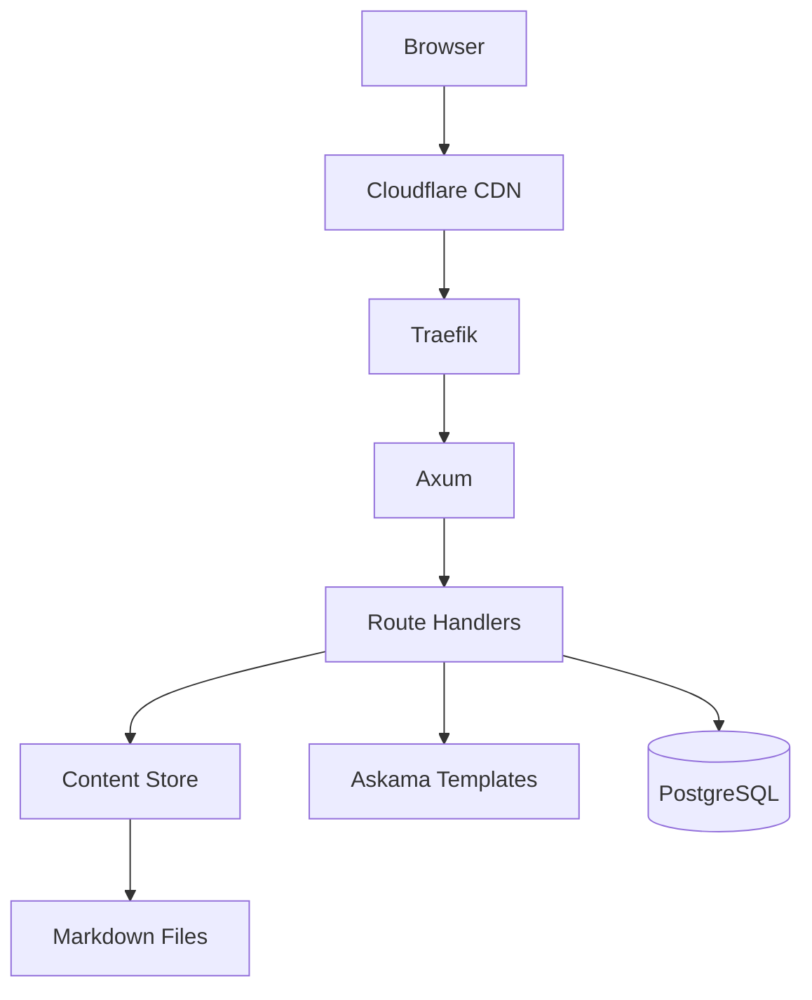
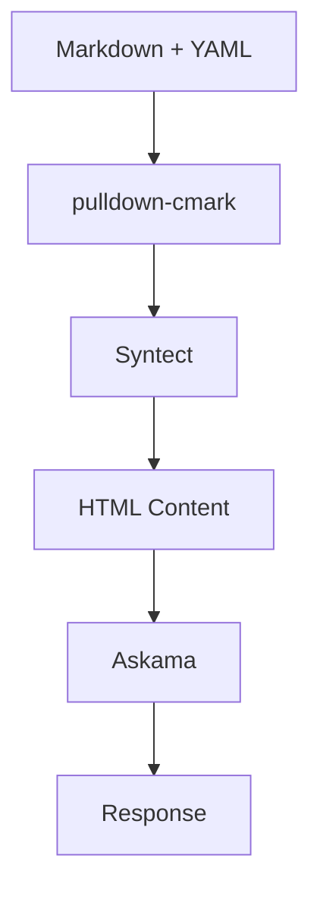
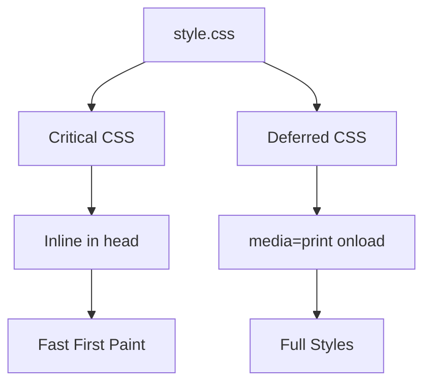
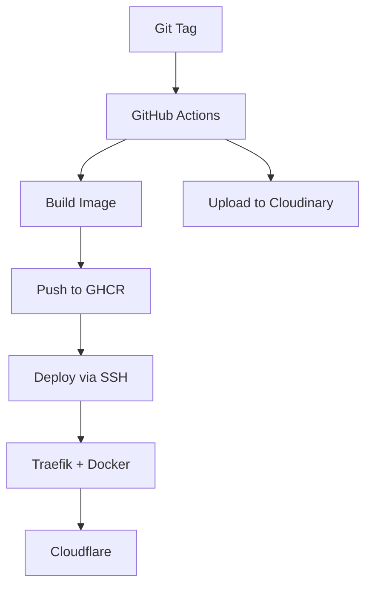

Nebula is the engine powering this website. A lightweight blog platform built with Rust, designed for speed, simplicity, and compile-time safety.

## Why Build a Custom Engine?

Static site generators like Hugo are great. They're fast, well-documented, and have tons of themes. So why build something custom?

**Learning** — I wanted hands-on experience with Rust web development. Not tutorials, not toy projects — something that runs in production.

**Control** — No fighting with theme limitations. Need a feature? Implement it exactly how you want.

**Fun** — Not everything needs to be pragmatic. Sometimes you build things because it's interesting.

## Architecture



**Request Flow:**

1. Browser sends request through Cloudflare CDN
2. Traefik terminates SSL, routes to container
3. Axum routes to appropriate handler
4. Handler reads from Content Store (cached in memory)
5. Askama renders template (compile-time checked)
6. Response sent — HTMX handles partial updates if needed

## Content Pipeline

Blog posts and projects live as Markdown files with YAML frontmatter:



**pulldown-cmark** parses Markdown with extensions (tables, footnotes, strikethrough, task lists).

**Syntect** provides syntax highlighting with the One Dark theme.

**Mermaid** diagrams render client-side, lazy-loaded only when needed.

Content is loaded at startup and cached in memory. Hot reload via admin endpoint — no redeploy for content changes.

## Performance Optimizations

Performance matters, even for a blog. Every optimization here serves a purpose.

### Critical CSS

The stylesheet is split into two parts:



Critical CSS (layout, typography, colors) is inlined in `<head>`. The rest loads asynchronously with `media="print" onload="this.media='all'"`. First paint happens before external resources load.

### CDN Fallback Chain

External scripts load through a fallback chain:

```javascript
var cdns = [
    'https://cdn.jsdelivr.net/npm/htmx.org@1.9.10/dist/htmx.min.js',
    'https://cdnjs.cloudflare.com/ajax/libs/htmx/1.9.10/htmx.min.js',
    'https://unpkg.com/htmx.org@1.9.10/dist/htmx.min.js'
];
```

If jsdelivr fails, try cdnjs. If cdnjs fails, try unpkg. This handles CDN outages and **DPI blocking in Russia** — some ISPs block specific CDN domains.

Scripts are also inlined in the HTML as a first attempt, with external fallback for caching benefits.

### Image Optimization

All images served through Cloudinary CDN with automatic format conversion (WebP where supported) and responsive sizing.

### Results

| Metric | Value |
|--------|-------|
| First Contentful Paint | <100ms |
| Response time | <10ms |
| Memory usage | ~20MB |
| Binary size | 15MB |
| JavaScript | ~14KB (HTMX) |

The entire site runs on a 1GB VPS.

## The Stack in Detail

### Axum

The web framework. Built on Tokio and Tower, it provides:

- Type-safe request extraction
- Composable middleware (compression, tracing, CORS)
- Async handlers with excellent ergonomics

```rust
pub async fn show(
    State(state): State<AppState>,
    Path(slug): Path<String>,
) -> Result<Html<String>, StatusCode> {
    let content = state.content.read().await;
    let post = content.posts.get(&slug)
        .ok_or(StatusCode::NOT_FOUND)?;
    // ...
}
```

The type signature tells you everything. Compiler enforces it.

### Askama

Templates that compile to Rust code. If it compiles, it works.

```rust
#[derive(Template)]
#[template(path = "blog/post.html")]
struct BlogPostTemplate<'a> {
    title: &'a str,
    content: &'a str,
    reading_time: u32,
}
```

Typo in a variable name? Compilation fails. Not deployment. Not runtime.

### SQLx

Compile-time checked SQL queries:

```rust
let messages = sqlx::query_as!(
    ContactMessage,
    "SELECT * FROM contact_messages WHERE created_at > $1",
    cutoff
)
.fetch_all(&pool)
.await?;
```

Misspell a column? Compiler catches it.

### HTMX

Interactivity without JavaScript frameworks. The server returns HTML fragments, HTMX swaps them into the page.

The contact form submits via HTMX, shows success/error messages, handles validation — all without React, Vue, or a build step.

## SEO & Social

### Meta Tags

Every page includes proper meta tags for search engines and social sharing:

- **Open Graph** — title, description, image, type
- **Twitter Cards** — summary_large_image format
- **Canonical URLs** — prevent duplicate content
- **Structured data** — article metadata

### Technical SEO

- **robots.txt** — crawl directives
- **sitemap.xml** — auto-generated, includes all posts and projects
- **RSS feed** — standard RSS 2.0 for blog posts
- **Semantic HTML** — proper heading hierarchy, article tags

### Favicons

Generated in multiple sizes for different devices:

| Size | Purpose |
|------|---------|
| 16×16 | Browser tab |
| 32×32 | Browser tab (retina) |
| 48×48 | Windows taskbar |
| 180×180 | iOS home screen |
| 192×192 | Android home screen |

## Security

### Contact Form

The contact form uses multiple layers of protection:

**Cloudflare Turnstile** — privacy-focused CAPTCHA alternative. No puzzles, no tracking.

**Server-side validation** — all inputs validated, sanitized, rate-limited.

**Resend** — transactional email delivery. Messages stored in PostgreSQL as backup.

## Development Workflow

### Git Hooks

Pre-commit hook runs `cargo fmt` automatically:

```bash
git config core.hooksPath .hooks
```

No more "fix formatting" commits.

### Release Automation

```bash
./scripts/release.sh 0.3.0
```

The script:
1. Updates version in `Cargo.toml`
2. Adds section to `CHANGELOG.md`
3. Updates `RELEASE_NOTES.md`
4. Creates commit and tag

Supports semantic versioning shortcuts:

```bash
./scripts/release.sh patch  # 0.2.19 → 0.2.20
./scripts/release.sh minor  # 0.2.19 → 0.3.0
./scripts/release.sh major  # 0.2.19 → 1.0.0
```

### Hot Reload

Edit markdown, call the admin endpoint:

```bash
curl -X POST "https://site.com/admin/reload?secret=$SECRET"
```

Changes are live. No redeploy, no restart.

## Deployment



**Code changes:** Push a tag → GitHub Actions builds Docker image → pushes to GHCR → deploys to VPS via SSH.

**Content changes:** Push to main → sync content directory → call reload endpoint.

### Infrastructure

| Component | Purpose |
|-----------|---------|
| VPS | Hetzner Cloud (1GB RAM) |
| Reverse Proxy | Traefik with auto SSL |
| Container Registry | GitHub Container Registry |
| CDN | Cloudflare (caching, DDoS protection) |
| Images | Cloudinary CDN |
| Analytics | Cloudflare Web Analytics |
| DNS | Cloudflare |

## Content Format

### Blog Post

```yaml
---
title: "Post Title"
slug: "post-slug"
description: "Short description for SEO"
date: "2025-01-27T10:00:00Z"
tags: ["rust", "web"]
cover_image: "https://cloudinary.com/.../cover.webp"
---
```

### Project

```yaml
---
title: "Project Name"
slug: "project-slug"
description: "Project description"
date: "2025-01-27T10:00:00Z"
tags: ["rust", "cli"]
status: "active"
github_url: "https://github.com/user/repo"
featured: true
cover_image: "https://cloudinary.com/.../cover.webp"
---
```

## Tech Stack

| Component | Technology |
|-----------|------------|
| Language | Rust |
| Framework | Axum 0.7 |
| Templates | Askama |
| Database | PostgreSQL + SQLx |
| Markdown | pulldown-cmark |
| Highlighting | Syntect |
| Diagrams | Mermaid |
| Frontend | HTMX |
| Images | Cloudinary |
| Email | Resend API |
| Captcha | Cloudflare Turnstile |
| Reverse Proxy | Traefik |
| CDN | Cloudflare |
| Analytics | Cloudflare Web Analytics |
| CI/CD | GitHub Actions |
| Registry | GitHub Container Registry |

## Links

- [GitHub Repository](https://github.com/alnovis/nebula)
- [Blog Post](/blog/hello-world) — Why I built it
