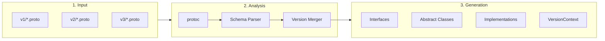
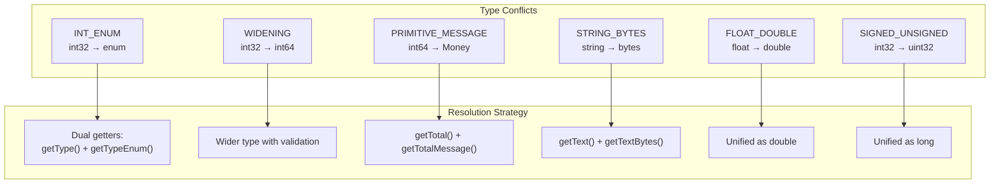

Proto Wrapper Plugin generates a unified Java API from multiple protobuf schema versions. Instead of writing version-specific code everywhere, you work with clean interfaces that abstract away the differences.

## The Problem It Solves

Long-lived systems accumulate protocol versions. Field types change (`int32` becomes `enum`), new fields appear, structures evolve. Without tooling, you end up with code like this scattered everywhere:

```java
if (version == 1) {
    int type = requestV1.getPaymentType();
    process(type);
} else if (version == 2) {
    PaymentType type = requestV2.getPaymentType();
    process(type.getNumber());
}
```

Proto Wrapper generates wrappers that handle this automatically:

```java
Payment payment = ctx.wrapPayment(anyVersionProto);
int type = payment.getPaymentType();  // Works with any version
```

## Architecture

The plugin works in three phases:



**Phase 1: Schema Parsing**
The plugin runs `protoc` on each version directory, extracting message structures, field types, and relationships.

**Phase 2: Version Merging**
Schemas are merged into a unified model. Fields with the same name/number are combined. Type conflicts are detected and classified.

**Phase 3: Code Generation**
JavaPoet generates clean Java code: interfaces for version-agnostic access, abstract classes with template methods, and version-specific implementations.

## Conflict Resolution

When field types differ between versions, the plugin generates appropriate accessors:



## Generated Code Structure

```
com.example.model/
├── api/                           # Version-agnostic
│   ├── Order.java                 # Interface
│   ├── OrderType.java             # Unified enum
│   ├── VersionContext.java        # Factory interface
│   ├── ProtocolVersions.java      # Version constants
│   └── impl/
│       └── AbstractOrder.java     # Template methods
├── v1/
│   ├── OrderV1.java               # V1 implementation
│   └── VersionContextV1.java      # V1 factory
├── v2/
│   ├── OrderV2.java               # V2 implementation
│   └── VersionContextV2.java      # V2 factory
└── v3/
    ├── OrderV3.java
    └── VersionContextV3.java
```

**Interfaces** define the version-agnostic API. All accessors, builders, serialization.

**Abstract classes** implement common logic using the Template Method pattern. Version-specific extraction is delegated to abstract `extract*` methods.

**Implementation classes** provide version-specific logic. Each one wraps the actual protobuf message for its version.

**VersionContext** is the entry point. It wraps raw protos and creates builders for the correct version.

## Design Patterns

The codebase uses several patterns that make it maintainable:

**Template Method** — Abstract classes define the algorithm skeleton, implementations fill in version-specific details.

**Chain of Responsibility** — Field processing delegates to specialized handlers based on conflict type.

**Strategy** — Each conflict handler implements a specific code generation strategy.

**Factory** — VersionContext provides version-aware object creation.

## Key Features

**Incremental builds** — Only regenerate when proto files actually change. 50%+ faster rebuilds on large projects.

**Embedded protoc** — No need to install protoc. The plugin downloads the right binary for your platform automatically.

**Builder pattern** — Full support for creating and modifying messages:

```java
Order order = Order.newBuilder(ctx)
    .setOrderId("ORD-001")
    .setTotal(Money.newBuilder(ctx)
        .setAmount(1000)
        .setCurrency("USD")
        .build())
    .build();
```

**Well-known types** — `google.protobuf.Timestamp` becomes `java.time.Instant`. `Duration` becomes `java.time.Duration`. No manual conversion needed.

**Schema diff tool** — Compare versions, detect breaking changes, integrate with CI:

```bash
mvn proto-wrapper:diff -Dv1=proto/v1 -Dv2=proto/v2 -DfailOnBreaking=true
```

**Spring Boot Starter** — Auto-configuration for Spring Boot 3+ with per-request version context.

## Tech Stack

| Component | Technology |
|-----------|------------|
| Language | Java 17+ |
| Code Generation | JavaPoet |
| Proto Parsing | protobuf-java + protoc |
| Maven Plugin | maven-plugin-api |
| Gradle Plugin | Kotlin DSL |
| Testing | JUnit 5, AssertJ |
| CI/CD | GitHub Actions |

## Quick Start

**Maven:**

```xml
<plugin>
    <groupId>io.alnovis</groupId>
    <artifactId>proto-wrapper-maven-plugin</artifactId>
    <version>2.2.0</version>
    <configuration>
        <basePackage>com.example.model</basePackage>
        <protoRoot>${basedir}/proto</protoRoot>
        <versions>
            <version><protoDir>v1</protoDir></version>
            <version><protoDir>v2</protoDir></version>
        </versions>
    </configuration>
    <executions>
        <execution><goals><goal>generate</goal></goals></execution>
    </executions>
</plugin>
```

**Gradle:**

```kotlin
plugins {
    id("io.alnovis.proto-wrapper") version "2.2.0"
}

protoWrapper {
    basePackage.set("com.example.model")
    protoRoot.set(file("proto"))
    versions {
        version("v1")
        version("v2")
    }
}
```

## Links

- [GitHub Repository](https://github.com/alnovis/proto-wrapper-plugin)
- [Maven Central](https://central.sonatype.com/artifact/io.alnovis/proto-wrapper-core)
- [Full Documentation](https://github.com/alnovis/proto-wrapper-plugin/tree/main/docs)
- [Blog Post](/blog/proto-wrapper-plugin) — Background and motivation
