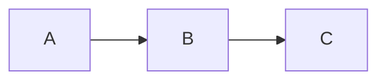
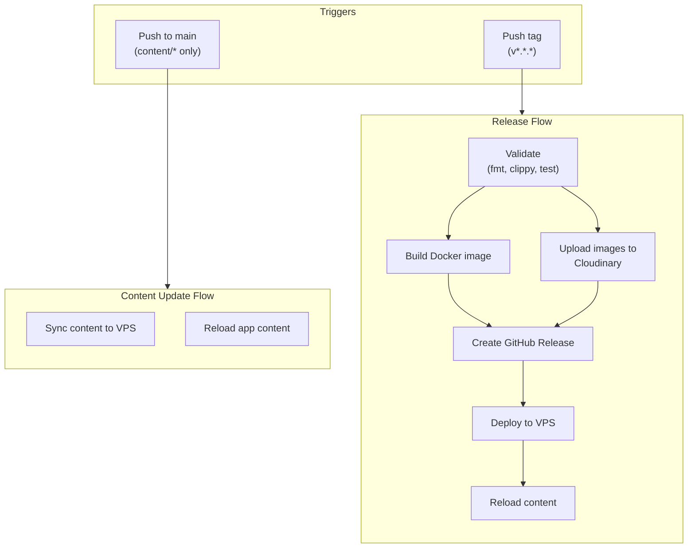

# Content Guide

This guide covers how to add content to the blog, create projects, prepare cover images, and understand the deployment pipeline.

## Table of Contents

- [Adding a Blog Post](#adding-a-blog-post)
- [Adding a Project](#adding-a-project)
- [Cover Images](#cover-images)
- [Deployment Pipeline](#deployment-pipeline)
- [Local Development](#local-development)

---

## Adding a Blog Post

### 1. Create the Markdown File

Create a new `.md` file in `content/blog/`:

```bash
touch content/blog/my-new-post.md
```

### 2. Add Frontmatter

Every post requires YAML frontmatter:

```yaml
---
title: "Post Title"
slug: "post-slug"
description: "Short description for SEO and social cards"
date: "2026-02-05T12:00:00Z"
tags: ["rust", "web", "tutorial"]
draft: false
cover_image: "my-post-cover.webp"
---
```

| Field | Required | Description |
|-------|----------|-------------|
| `title` | Yes | Post title |
| `slug` | Yes | URL slug (must match filename without `.md`) |
| `description` | Yes | SEO description, shown in cards |
| `date` | Yes | ISO 8601 format |
| `tags` | Yes | Array of tags |
| `draft` | No | Set `true` to hide from listing (default: `false`) |
| `cover_image` | No | Cloudinary URL for cover image |

### 3. Write Content

Use standard Markdown with:

- **Code blocks** with syntax highlighting (specify language)
- **Mermaid diagrams** in fenced blocks (lazy-loaded)
- **Images** via Cloudinary URLs

```markdown
## Introduction

Some text here...

```rust
fn main() {
    println!("Hello, world!");
}
```


```

### 4. Preview Locally

```bash
cargo run
# Visit http://localhost:3000/blog/post-slug
```

### 5. Publish

Commit and push to `main`. The content will be synced automatically.

---

## Adding a Project

### 1. Create the Markdown File

```bash
touch content/projects/my-project.md
```

### 2. Add Frontmatter

```yaml
---
title: "Project Name"
slug: "project-slug"
description: "Project description"
date: "2026-02-05T12:00:00Z"
tags: ["rust", "cli", "tool"]
status: "active"
github_url: "https://github.com/user/repo"
featured: true
cover_image: "project-cover.webp"
---
```

| Field | Required | Description |
|-------|----------|-------------|
| `title` | Yes | Project name |
| `slug` | Yes | URL slug |
| `description` | Yes | Project description |
| `date` | Yes | Creation/publish date |
| `tags` | Yes | Technology tags |
| `status` | Yes | `active`, `completed`, `archived`, or `planned` |
| `github_url` | No | GitHub repository URL |
| `featured` | No | Show on home page (default: `false`) |
| `cover_image` | No | Cloudinary URL |

---

## Cover Images

Cover images are stored on Cloudinary and displayed on post/project pages and in social cards.

### Image Requirements

| Property | Requirement |
|----------|-------------|
| Format | WebP (converted from PNG/JPG) |
| Dimensions | 1200x630px recommended (2:1 ratio for OG cards) |
| File size | Under 200KB after conversion |
| Location | `static/images/{slug}-cover.webp` |

### Preparation Steps

#### 1. Create or Generate the Image

Design your cover image at **1200x630px** or larger with 2:1 aspect ratio.

#### 2. Convert to WebP

Using ImageMagick:

```bash
# From PNG
magick input.png -quality 85 static/images/my-post-cover.webp

# From JPG
magick input.jpg -quality 85 static/images/my-post-cover.webp

# With resize (if needed)
magick input.png -resize 1200x630 -quality 85 static/images/my-post-cover.webp
```

Alternative with `cwebp` (if installed):

```bash
cwebp input.png -o static/images/my-post-cover.webp -q 85
```

#### 3. Naming Convention

Follow the pattern `{slug}-cover.webp`:

```
static/images/
├── compiler-ideas-cover.webp
├── proto-wrapper-cover.webp
├── rust-web-cover.webp
└── ...
```

#### 4. Update Frontmatter

Add the filename to your post (without the full URL):

```yaml
cover_image: "my-post-cover.webp"
```

The system automatically resolves the URL:
- **Production**: `https://res.cloudinary.com/ddkzhz9b4/image/upload/nebula/my-post-cover.webp`
- **Development**: `/images/my-post-cover.webp` (served from `static/images/`)

This means cover images work locally without uploading to Cloudinary first.

#### 5. Upload Happens Automatically

Images in `static/images/*.webp` are uploaded to Cloudinary during the release workflow (when you push a tag).

For manual upload (requires Cloudinary credentials):

```bash
export CLOUDINARY_API_KEY="your-key"
export CLOUDINARY_API_SECRET="your-secret"
./scripts/upload-images.sh
```

---

## Deployment Pipeline

### Overview



### Workflows

#### 1. `build.yml` — Continuous Integration

**Trigger:** Push or PR to `main`

**Steps:**
1. Check formatting (`cargo fmt --check`)
2. Run Clippy (`cargo clippy -- -D warnings`)
3. Build (`cargo build --release`)
4. Run tests (`cargo test`)

#### 2. `content.yml` — Content Updates

**Trigger:** Push to `main` that changes `content/**`

**Steps:**
1. Sync `content/` directory to VPS via SCP
2. Call `/admin/reload` endpoint to hot-reload content

This allows publishing new posts without rebuilding the Docker image.

#### 3. `release.yml` — Full Release

**Trigger:** Push a version tag (`v*.*.*`)

**Steps:**
1. **Validate** — format, lint, build, test
2. **Build Docker** — multi-stage build, push to `ghcr.io`
3. **Upload Media** — upload `static/images/*.webp` to Cloudinary
4. **Create Release** — GitHub release with changelog
5. **Deploy** — pull image on VPS, restart container
6. **Reload** — trigger content reload, health check

### Publishing Workflow

#### Content-Only Update (No Code Changes)

```bash
# 1. Add/edit content
vim content/blog/my-post.md

# 2. Add cover image (if any)
magick cover.png -quality 85 static/images/my-post-cover.webp

# 3. Commit and push
git add content/ static/images/
git commit -m "Add new blog post"
git push origin main
```

The `content.yml` workflow syncs content automatically. Images will be uploaded on next release.

#### Full Release (Code + Content)

```bash
# 1. Prepare changes
vim src/routes/blog.rs
vim content/blog/my-post.md

# 2. Run release script
./scripts/release.sh patch  # or minor/major/0.3.0

# 3. Edit CHANGELOG.md with actual changes

# 4. Amend commit and push
git add CHANGELOG.md
git commit --amend --no-edit
git push origin main --tags
```

### Environment Secrets Required

| Secret | Description |
|--------|-------------|
| `VPS_HOST` | VPS IP or hostname |
| `VPS_USER` | SSH username |
| `VPS_SSH_KEY` | SSH private key |
| `ADMIN_SECRET` | Secret for `/admin/reload` endpoint |
| `CLOUDINARY_CLOUD_NAME` | Cloudinary cloud name |
| `CLOUDINARY_API_KEY` | Cloudinary API key |
| `CLOUDINARY_API_SECRET` | Cloudinary API secret |

### Environment Variables

| Variable | Default | Description |
|----------|---------|-------------|
| `ENVIRONMENT` | `development` | Set to `production` for Cloudinary URLs |
| `CLOUDINARY_BASE_URL` | `https://res.cloudinary.com/ddkzhz9b4/image/upload/nebula` | Base URL for images |

---

## Local Development

### Prerequisites

- Rust 1.75+
- PostgreSQL 16+
- Docker (for database)
- ImageMagick (for image conversion)

### Setup

```bash
# Start PostgreSQL
docker compose up -d

# Copy environment
cp .env.example .env

# Run
cargo run
```

### Hot Reload Content

Content is loaded at startup. To reload without restart:

```bash
curl -X POST "http://localhost:3000/admin/reload?secret=your-secret"
```

### Testing Posts

Set `draft: true` in frontmatter to hide from listing while testing.

```yaml
draft: true
```

The post is still accessible directly at `/blog/{slug}` for preview.

---

## Quick Reference

### File Locations

| Content Type | Location |
|--------------|----------|
| Blog posts | `content/blog/*.md` |
| Projects | `content/projects/*.md` |
| Cover images | `static/images/*-cover.webp` |

### URL Patterns

| Type | URL |
|------|-----|
| Blog post | `/blog/{slug}` |
| Project | `/projects/{slug}` |
| Cover image | `https://res.cloudinary.com/ddkzhz9b4/image/upload/nebula/{slug}-cover.webp` |

### Commands

```bash
# Local dev
cargo run

# Convert image to webp
magick input.png -quality 85 static/images/name-cover.webp

# Manual content reload
curl -X POST "http://localhost:3000/admin/reload?secret=$ADMIN_SECRET"

# Create release
./scripts/release.sh patch
```
