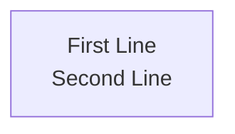
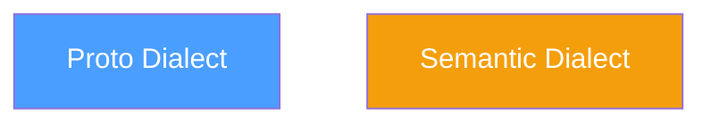
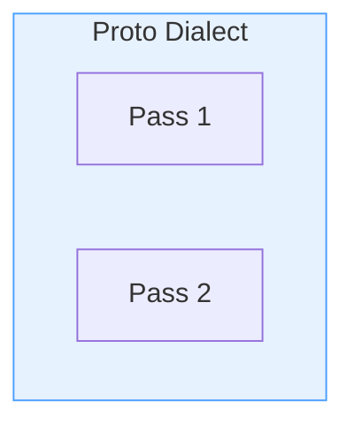

# Mermaid Export Guide

Export Mermaid diagrams to PNG with exact nebula styles for use on platforms that don't support Mermaid (Habr, Medium, etc.).

## Overview

The export script uses Puppeteer to render Mermaid diagrams with the same configuration as the nebula website, ensuring visual consistency across platforms.

## Prerequisites

```bash
npm install puppeteer
```

## Usage

### Export Single Diagram

```bash
node export-mermaid.js diagram.mmd output.png
```

### Export All Diagrams in Directory

```bash
node export-mermaid.js --all diagrams/
```

## Script Location

Copy the script to your article directory:

```
articles/my-article/
├── export-mermaid.js
├── package.json
└── diagrams/
    ├── 01-diagram.mmd
    ├── 02-diagram.mmd
    └── ...
```

## Script Source

```javascript
#!/usr/bin/env node
const puppeteer = require('puppeteer');
const fs = require('fs');
const path = require('path');

// Nebula mermaid configuration (from static/js/main.js)
const NEBULA_CONFIG = {
    startOnLoad: false,
    theme: 'dark',
    themeVariables: {
        fontSize: '16px',
        fontFamily: '-apple-system, BlinkMacSystemFont, "Segoe UI", Roboto, sans-serif',
        primaryColor: '#6366f1',
        primaryTextColor: '#e0e0e0',
        primaryBorderColor: '#6366f1',
        lineColor: '#888',
        secondaryColor: '#1a1a1a',
        tertiaryColor: '#2a2a2a',
        background: '#0f0f0f',
        mainBkg: '#1a1a1a',
        nodeBorder: '#6366f1',
        clusterBkg: '#1a1a1a',
        edgeLabelBackground: '#1a1a1a'
    },
    flowchart: {
        nodeSpacing: 50,
        rankSpacing: 50,
        curve: 'basis',
        padding: 15
    }
};

const HTML_TEMPLATE = `
<!DOCTYPE html>
<html>
<head>
    <meta charset="UTF-8">
    <style>
        * { margin: 0; padding: 0; box-sizing: border-box; }
        body {
            background: #0f0f0f;
            display: flex;
            justify-content: center;
            align-items: center;
            min-height: 100vh;
            padding: 20px;
        }
        #container { display: inline-block; }
    </style>
</head>
<body>
    <div id="container"></div>
    <script src="https://cdn.jsdelivr.net/npm/mermaid@10/dist/mermaid.min.js"></script>
    <script>
        window.renderDiagram = async function(code, config) {
            mermaid.initialize(config);
            const { svg } = await mermaid.render('diagram', code);
            document.getElementById('container').innerHTML = svg;
            await document.fonts.ready;
            const svgEl = document.querySelector('#container svg');
            const bbox = svgEl.getBoundingClientRect();
            return {
                width: Math.ceil(bbox.width) + 40,
                height: Math.ceil(bbox.height) + 40
            };
        };
    </script>
</body>
</html>
`;

async function exportMermaid(inputPath, outputPath) {
    const mermaidCode = fs.readFileSync(inputPath, 'utf-8');
    console.log(`Exporting: ${inputPath} -> ${outputPath}`);

    const browser = await puppeteer.launch({
        headless: 'new',
        args: ['--no-sandbox', '--disable-setuid-sandbox']
    });

    try {
        const page = await browser.newPage();
        await page.setViewport({ width: 1920, height: 1080, deviceScaleFactor: 2 });
        await page.setContent(HTML_TEMPLATE, { waitUntil: 'networkidle0' });

        const dimensions = await page.evaluate(
            (code, config) => window.renderDiagram(code, config),
            mermaidCode,
            NEBULA_CONFIG
        );

        await page.setViewport({
            width: dimensions.width,
            height: dimensions.height,
            deviceScaleFactor: 2
        });

        await new Promise(r => setTimeout(r, 100));

        const container = await page.$('#container');
        await container.screenshot({ path: outputPath, omitBackground: false });

        console.log(`  Done: ${dimensions.width}x${dimensions.height}`);
    } finally {
        await browser.close();
    }
}

async function exportAll(diagramsDir) {
    const files = fs.readdirSync(diagramsDir)
        .filter(f => f.endsWith('.mmd'))
        .sort();

    console.log(`Found ${files.length} .mmd files\n`);

    for (const file of files) {
        const inputPath = path.join(diagramsDir, file);
        const outputPath = path.join(diagramsDir, file.replace('.mmd', '.png'));
        await exportMermaid(inputPath, outputPath);
    }

    console.log('\nAll done!');
}

async function main() {
    const args = process.argv.slice(2);

    if (args.length === 0 || args[0] === '--help') {
        console.log(`
Usage:
  node export-mermaid.js input.mmd output.png   Export single diagram
  node export-mermaid.js --all                   Export all .mmd in diagrams/
  node export-mermaid.js --all /path/to/dir      Export all .mmd in specified dir
`);
        process.exit(0);
    }

    if (args[0] === '--all') {
        const dir = args[1] || path.join(__dirname, 'diagrams');
        await exportAll(dir);
    } else {
        const inputPath = args[0];
        const outputPath = args[1] || inputPath.replace('.mmd', '.png');
        await exportMermaid(inputPath, outputPath);
    }
}

main().catch(err => {
    console.error('Error:', err);
    process.exit(1);
});
```

## Mermaid Syntax Notes

### Line Breaks

Use `<br/>` for line breaks in node labels (not `\n`):



### Node Styles

Apply custom colors with `style` directive:



### Subgraph Styles

Semi-transparent backgrounds for subgraphs:



## Post-Export Workflow

### 1. Convert to WebP

```bash
for f in *.png; do
    magick "$f" -quality 85 "${f%.png}.webp"
done
```

### 2. Upload to Cloudinary

```bash
export CLOUDINARY_API_KEY="your-key"
export CLOUDINARY_API_SECRET="your-secret"

CLOUD_NAME="ddkzhz9b4"
for img in *.webp; do
    filename=$(basename "$img" .webp)
    public_id="nebula/$filename"
    timestamp=$(date +%s)
    signature=$(echo -n "public_id=$public_id&timestamp=$timestamp$CLOUDINARY_API_SECRET" | sha1sum | cut -d' ' -f1)

    curl -s -X POST "https://api.cloudinary.com/v1_1/$CLOUD_NAME/image/upload" \
        -F "file=@$img" \
        -F "public_id=$public_id" \
        -F "timestamp=$timestamp" \
        -F "api_key=$CLOUDINARY_API_KEY" \
        -F "signature=$signature" \
        | jq -r '.secure_url'
done
```

### 3. Use in Markdown

```markdown

```

### 4. Resize with Cloudinary

Add width transformation to URL:

```markdown

```

| Transform | Effect |
|-----------|--------|
| `w_800` | Width 800px |
| `w_0.5` | 50% of original |
| `h_400` | Height 400px |
| `c_scale,w_800` | Scale to 800px width |

## Comparison with mermaid-cli

| Feature | Puppeteer Script | mermaid-cli (mmdc) |
|---------|-----------------|-------------------|
| Style accuracy | Exact nebula styles | Requires config file |
| Line breaks | `<br/>` works | `<br/>` works |
| Custom themes | Full control | Via JSON config |
| Background | Configurable | Via `-b` flag |
| Dependencies | puppeteer | @mermaid-js/mermaid-cli |

The Puppeteer approach ensures diagrams look identical to the website rendering.
